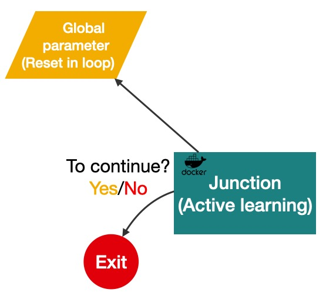

.. _active_learning:

Active learning step
------------------------------------

Experimental data is useful to constrain the allowed parameter ranges in theoretical models.
In practise, we are looking for exclusion contours in the parameter space
When the number of free parameter is larger, it is crucial to sketch the contour using minimum amount of points in the high dimensional search space.
This process is the last step of a single loop and can be mapped to the junction/checkpoint step of pchain.
It performs decision making on values of parameters for next loops based on the historical upper limit results.

A popular algorithm for solving such tasks is Gaussian Process, although other algorithms are possible.
We provide a container with many of the algorithms available and a script `active_learning_zz.py <https://gitlab.cern.ch/zhangruihpc/SteeringContainer/-/blob/master/module/active_learning_zz.py>`_ as an example to show how to call the algorithm (the script can be inside the container or submit as a local file through ``pchain``).
The script essentially used APIs from a library of ``hpogrid`` (`repo <https://gitlab.cern.ch/aml/hyperparameter-optimization/alkaid-qt/hpogrid/-/tree/master/hpogrid>`_) but you are free to directly access the available algorithms `hyperopt <http://hyperopt.github.io/hyperopt/>`_,  `nevergrad <https://facebookresearch.github.io/nevergrad/>`_, `scikit-optimize <https://scikit-optimize.github.io/stable/>`_, `Ray[tune] <https://docs.ray.io/en/latest/tune/index.html>`_.

With the following command, the script will produce two json files ``results.json`` and ``history.json``.
The first file containing updated values for the local parameter is needed by the ``junction`` executable as discussed in Section :ref:`cwl_main` and the second is the persistent file to record all historical results.
These will be used when construct the junction block in pchain discussed shortly.

.. code-block:: console

    # '/ATLASMLHPO/module/' is the full path inside this container
    python /ATLASMLHPO/module/active_learning_zz.py -pv myparamMZD 30 myparamMH 60

.. warning::
    We are extending the junction step to allow parallelising more jobs and the command and script may update.

Integrate to pchain
^^^^^^^^^^^^^^^^^^^^^^^^^^^^^^^^^^^^^^^^^^^^

Below is the junction step in CWL.

.. _pchain_cwl_code3:
.. literalinclude:: ../../cwl/pchain/junct.cwl
    :language: yaml
    :linenos:
    :caption: Junction step in pchain

Again, all the magic is in the ``script_junction.sh`` script.
Here is how it look like:

.. _pchain_script_junction:
.. literalinclude:: ../../cwl/pchain/script_junction.sh
    :language: bash
    :linenos:
    :caption: script_junction.sh

In this example, it runs four loops to as indicated in L4.