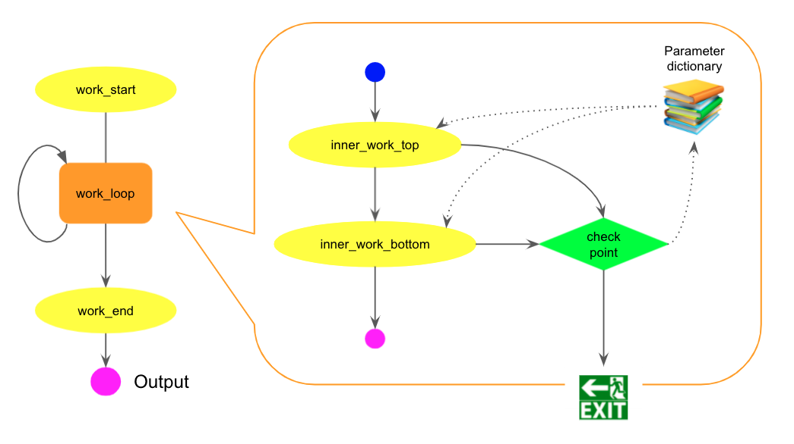
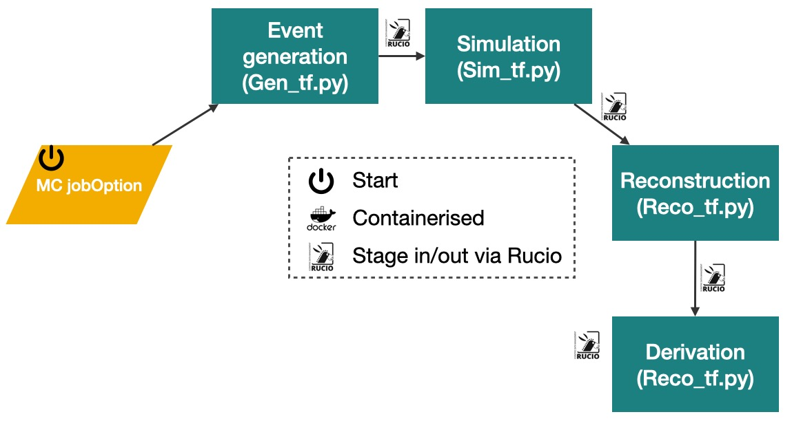

.. _cwl_main:

Workflow description in CWL
------------------------------------
A workflow is a set of jobs with certain relationships.
Using Common Workflow Language (CWL), one can describe various types of workflow, simple or complex.
In the `PanDA Doc <https://panda-wms.readthedocs.io/en/latest/client/pchain.html#workflow-examples>`_ listed a lot of such examples with the CWL descriptive code.
In the application of active learning, we will use the particular example of *Loops in workflows*.
Its DAG (directed acyclic graph) scheme is illustrated in the figure below.

This DAG consists of three parts -- `work_start` (necessary configurations globally before entering the loop), `work_loop` (can be another subtask), `work_end` (final step when all loops are done).
The loop body contains three steps -- `top`, `bottom` and `checkpoint` (also know as `junction`) steps.
The junction step make a decision at the end of each loop of whether continue the loop or quit.
When quit, the workflow will finish up with the work_end step.

Please take a look at the `Loop CWL description <https://panda-wms.readthedocs.io/en/latest/client/pchain.html#loops-in-workflows>`_ before moving on.
Here let's summarise a few key points:

    - CWL scripts can include other CWL scripts for better organisations; here we are more interested in ``loop_body.cwl``.
    - Local variables such as ``xxx``, ``yyy`` are defined in the ``input`` section with the ``param_`` prefix and their initial values. ``i`` is reserved as the counter of the loop and can be accessed via ``%{i}``.
    - The checkpoint step which calls ``junction`` executable (a variant of ``prun``) must produce a json file called ``results.json`` that contains updated values for the local parameter dictionary and a special key-value pair of ``to_continue: True`` to indicate whether to continue or quit the loop.
    - It is possible to specify a file via ``--persistentFile`` in ``opt_args`` which cann be use as a persistent file to record complex information, for example to record the history of the results from active learning.

Map to active learning steps
^^^^^^^^^^^^^^^^^^^^^^^^^^^^^^^^^^^^^^^^^^^^
The active learning can be easily mapped to this paradigm.
Recall the schematic view of active learning loop.
In this section, we will focus on the production steps from MC jobOption to Derivation, and discuss the later steps in next sections.

The scheme (without loops) can be mapped to a sequential workflow (refer to the `top-bottom workflow`).
Here we put an implementation for an ATLAS dark matter search (Z-dark) in four-lepton final states [1]_.

.. _pchain_cwl_code:
.. literalinclude:: ../../cwl/pchain/prod.cwl
    :language: yaml
    :linenos:
    :caption: production sequence CWL

Here we defined two local variables ``myparamMZD`` and ``myparamMHD`` at **L5-10** and they are used in **L22** to assign values to bash environment variables.
Remember we discussed in Section :ref:`jobOption` to use shell environment variables for certain parameters, so these values will be taken there.
We will put the jobOption file in ``999999/<jobOptioin.py>`` locally when submitting the pchain task, therefore ``--jobConfig=999999``.
The commands in ``opt_exec`` are standard ATLAS production commands; you could ask your MC production manager or check the bigPanda page.
These commands requires Athena from ATLAS, thus each step contains ``opt_useAthenaPackages`` of true as in **L25-26**, **L37-38**, **L49-50**, and **L61-62**.

.. tip::
   How to find commands from a prodtask page, eg `this request <https://prodtask-dev.cern.ch/prodtask/inputlist_with_request/43259/>`_ (for ATLAS internal).

   - Click one of the green boxes and navigated to a PanDA task page like https://bigpanda.cern.ch/task/28927633/;
   - Click [Show jobs] -> [All (including retries)] and click one of the PanDA ID to go to a job page;
   - Click [Logs] -> [Log files] -> pilotlog.txt;
   - Look for similar line as below and extract the command.
  
      >>> 2022-05-03 18:52:24,559 | INFO     | payload run command:...; Gen_tf.py --maxEvents=10000 --skipEvents=20000 --ecmEnergy=13000 --firstEvent=20001 --jobConfig=512443 --outputEVNTFile=EVNT.28927633._000003.pool.root.1 --randomSeed=3 --runNumber=512443 --AMITag=e8448;

.. [1] The ATLAS Collaboration, `HDBS-2018-55 <https://atlas.web.cern.ch/Atlas/GROUPS/PHYSICS/PAPERS/HDBS-2018-55/>`_.
