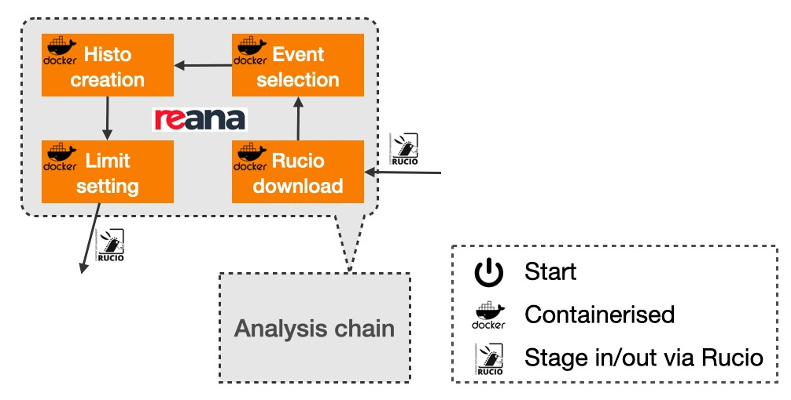

.. _reana_workflow:

REANA workflow
------------------------------------

A physics analysis usually starts with derivation files (DAOD), which should have been produced after Section :ref:`cwl_main`.
An analysis may consist of several steps for example first event selection to make smaller ntuples, then histogram creation for statistical analysis, and last limit setting.
These steps form a workflow and can run either on Grid via PanDA, or on smaller clusters or even laptops for convenience.
In active learning, the computing resources required is much higher than to perform a single analysis, therefore, we will use a medium system `REANA <https://docs.reana.io>`_ for active learning.
First, let's recall what we need to do in figure below.

.. note::
   REANA is a reproducible analysis platform.
   Currently, an instance at CERN (https://reana.cern.ch) is running and in the future, more instances may become available.
   You need to apply for a user account before using the CERN instance as it is now still under development and not open to everyone.

.. note::
   The real work that is running on REANA should be performed in containers.
   For more information about container and docker image, see `docker doc <https://docs.docker.com/get-started/overview/>`_.
   It is a dedicated topic to create containers for your analysis code.
   For now, let's assume that you know what container is and how to containerise your analysis code.

REANA supports several workflow languages such as CWL, Serial, Yadage, Snakemake.
We will take CWL as an example since we should be familiar with it now.

Basic
^^^^^^^^^^^^^^^^^^^^^^^^^^^^^^^^^^^^^^^^^^^^
A few `examples <https://docs.reana.io/getting-started/>`_ can be found in the REANA Doc.
However, these examples combine analysis code and REANA configurations together and have some repetition scripts to showcase the syntax for different computing backends.
To make it simple, one can refer to the `ATLAS HDBS-2018-55 example <https://gitlab.cern.ch/zhangruihpc/reana-zz/-/tree/demonstrate>`_.

::

    ├── reana.yaml
    └── specs
        ├── steps.yml
        └── workflow.yml
    1 directory, 3 files

The REANA specification file at the top level whose name has to be ``reana.yaml``.
Besides it, all other file and directory names are user-defined.
It defines input data, output files, reference to the name of a file where the real workflow is defined (``specs/workflow.yml``), and resources.
In this example, ``cvmfs`` is mounted.

In the ``specs/workflow.yml`` file, four stages are defined.
Names of the stages are user-defined, and they can be used in ``dependencies`` to indicate the workflow order.
Let's go through one of the stage line by line and explain what each line does.

.. code-block:: yaml
    :linenos:

    - name: ntuple_stage
        dependencies: [rucio_download]
        scheduler:
            scheduler_type: singlestep-stage
        parameters:
            local_dr: {step: rucio_download, output: pub_local_dr}
            outputfile: '{workdir}/my.output.root'
        step: {$ref: 'specs/steps.yml#/ntupleselection'}

- **L1** defines the name of the stage.
- **L2** configs that this stage will run after ``rucio_download`` stage finishes.
- **L3-4** is related to scheduler for the job that users do not care about.
- **L5-7** defines two local variables called ``deriva_sample`` and ``local_dr``. They will be used in ``specs/steps.yml``. The value of ``local_dr`` is defined by the local parameter ``pub_local_dr`` in the previous step; so it can dynamically change according to the previous output. The value of ``outputfile`` is ``{workdir}/my.output.root``. Note that ``{workdir}`` is a keyword in REANA that stores a common path where all the stages have access. Therefore it is very useful share files between stages.
- **L8** is a reference to a code block in ``specs/steps.yml``.

The real executions are defined in ``specs/steps.yml``.
The commands under ``script`` are closely related to your analysis container except the first one that is dedicated to downloading DAOD via Rucio.
The rest of the part are output files (in ``publisher:publish``) and the container (in ``environment:image``).
In order to use Rucio, one needs to not only enable ``voms_proxy: true``, but also provide your Grid certificate.

.. tip::
   Try to use a large ``kubernetes_memory_limit`` as insufficient memory will lead to job failure and not always easy to notice.
   ``kubernetes_uid: 1000`` is used in all these examples as these containers happen to have the user ID as 1000. Check your own user ID in container by ``echo $UID``.

Use Rucio
^^^^^^^^^^^^^^^^^^^^^^^^^^^^^^^^^^^^^^^^^^^^
Currently REANA is not part of the ATLAS Grid and no native Rucio is installed on REANA.
However, we could run a container that has Rucio installed, download the DAOD we need (since they are only signal samples, the size will be affordable), and place them in ``{workdir}`` to share with the rest stages.
You can either make your own or use this one (``gitlab-registry.cern.ch/zhangruiforked/reana-demo-atlas-recast-2:0.4``) as used in the above example.
To use Rucio, you need to config ``voms_proxy: true`` at that stage and provide a VOMS proxy (`instruction <https://docs.reana.io/advanced-usage/access-control/voms-proxy/>`_) before submitting REANA tasks.

Integrate to pchain
^^^^^^^^^^^^^^^^^^^^^^^^^^^^^^^^^^^^^^^^^^^^
A standalone REANA workflow can be submitted from lxplus as illustrated in the `example <https://docs.reana.io/getting-started/first-example/>`_ of REANA.
But our goal is to run the REANA step seamlessly with the production chain that we had finished.
One scheme could be that PanDA do the submission on behalf of users.
A better scheme may be worked out in the future with both the PanDA team and the REANA team involved, while right now, this simple scheme works fine.
We append following lines to the end of the :ref:`CWL code<pchain_cwl_code>`.

.. _pchain_cwl_code2:
.. literalinclude:: ../../cwl/pchain/reana.cwl
    :language: yaml
    :linenos:
    :caption: REANA step in pchain

The output dataset from ``inner_work_deriv`` step is taken, i.e. the DAOD, and its name is hold by ``%{DS0}``.
You may notice ``--useSecrets``.
We use the `PanDA secrete<https://panda-wms.readthedocs.io/en/latest/client/secret.html>`_ feature to tell PanDA our ``REANA_ACCESS_TOKEN`` so that it can submit REANA task on behalf.
That said, before running ``pchain`` workflow, one must create secrets.
For example, here are the secretes you may need:

.. code-block:: console

    $ pbook
    >>> list_secrets()
    Key                : Value
    ------------------ : --------------------
    REANA_ACCESS_TOKEN : **********
    usercert.pem       : **********
    userkey.pem        : **********

All the rest mystery is in the ``script_reana.sh`` script, which takes a string of ``prod_ZZ`` and the DAOD name, and outputs ``output_from_reana.tar``.
Let's peek what's inside this script.

.. _pchain_script_reana:
.. literalinclude:: ../../cwl/pchain/script_reana.sh
    :language: bash
    :linenos:
    :emphasize-lines: 11,12,32-40
    :caption: script_reana.sh

This is just an example and you can replace it by your own.
However, you may find the highlight blocks unusual as the example from REANA.
In the first highlighted block, we actually secretly replaced the ``reana.yaml`` file by a template which contains a placeholder as input.
This block of code will insert proper DAOD name.
The second highlight block does a waiting and download the outputs from the REANA workflow.
In our example, this output is a folder called ``limit_stage`` inside of which are a couple of limit files.
The whole folder is compressed to ``output_from_reana.tar`` and will be staged out (rucio upload) at the end of the job (if you remember, we had ``--outputs output_from_reana.tar`` in L10 of :ref:`CWL file<pchain_cwl_code2>`.)

