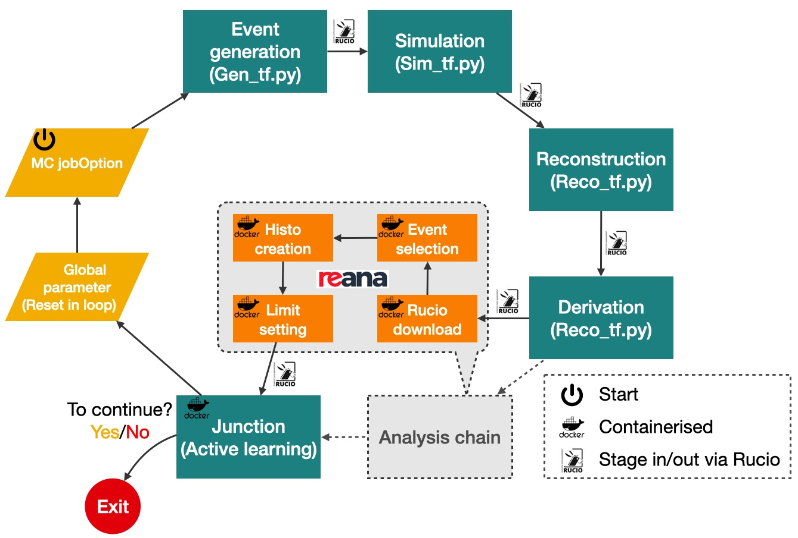

Documentation for Active Learning using pchain
=====================================================

``pchain`` is a CLI tool to submit a series of jobs, organised as a workflow, to `PanDA <https://panda-wms.readthedocs.io/en/latest/index.html>`_ for ATLAS users.
It currently supports Common Workflow Language (CWL) for workflow description but can be extended if there is high demand.
This website explains how to use this tool to run active learning for physics searches and some showcases to reproduce some physics results.

On any machine that has ``cvmfs`` mounted, one can submit a task via the following commands:

.. code-block:: console

   setupATLAS
   lsetup panda
   pchain --cwl loop.cwl --yaml input.yaml --outDS user.$USER.myworkflow

Depending on the task to run, one may also need to setup a certain ATLAS Athena environment, for example for evgen, before running the ``pchain`` command, do

.. code-block:: console

   asetup AthGeneration,21.6.92,here

The following figure illustrate a general active learning workflow.
The workflow starts with a Monte-Carlo job option file that is needed to generate signal MC events, then process through the event generation, simulation, reconstruction, and derivation steps via PanDA using the ATLAS Grid computing infrastructure.
Then the output files of the derivation step will be processed by the analysis chain on an `REANA <https://docs.reana.io>`_ instance.
Outcome of the analysis chain, which is usually an upper limit that corresponding to the signal process defined in the job option file, is handed over to the junction step to make active learning decision for next iteration.

.. note::

   This project is under development.

.. toctree::
   :maxdepth: 2
   :caption: Table of Contents

   create_workflow/main

Related resources
--------
- presentation
